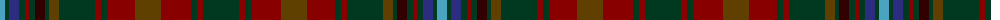

The parent of this is [Ben Murad (Personal)](/tartans/b/10/dg4/db10/dg6/dra4/dg6/dr10/dg4/t10/dg36/dra6/dg6/dra28/t26/dra30/dg6/dra6/dg/36/)

This was sourced from tartans-authority.  It is a [18 stripes tartan](/stripes/stripes18/).

Original link http://www.tartansauthority.com/tartan-ferret/display/11003/

## Thread count
B/10 DG4 DB10 DG6 DRa4 DG6 DR10 DG4 T10 DG36 DRa6 DG6 DRa28 T26 DRa30 DG6 DRa6 DG/36

## Palette
Each colour and its ΔE from the base-6 reference it is a variant of.

| Colour | Shade | Base | ΔE (OKLab) |
|---|---|---|---|
| B |  `#48A4C0` | Y  | 0.28 |
| DB |  `#2C2C80` | B  | 0.05 |
| DG |  `#003820` | G  | 0.16 |
| DR |  `#320000` | K  | 0.22 |
| DRa |  `#880000` | R  | 0.14 |
| T |  `#604000` | G  | 0.14 |

ID: /variants/b/10/dg4/db10/dg6/dra4/dg6/dr10/dg4/t10/dg36/dra6/dg6/dra28/t26/dra30/dg6/dra6/dg/36-b48a4c0-db2c2c80-dg003820-dr320000-dra880000-t604000/
