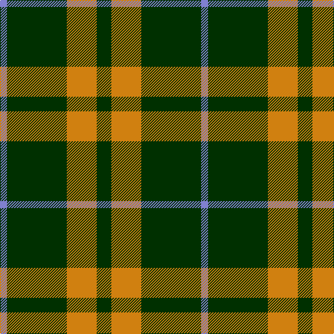

The parent of this is [Special, Saffron](/tartans/b/10/dg86/o43/dg/21/)

This was sourced from weddslist.  It is a [4 stripes tartan](/stripes/stripes4/).

Original link http://www.weddslist.com/cgi-bin/tartans/pg.pl?source=sts

## Thread count
B/10 DG86 O43 DG/21

## Palette
Each colour and its ΔE from the base-6 reference it is a variant of.

| Colour | Shade | Base | ΔE (OKLab) |
|---|---|---|---|
| B |  `#8080D0` | B  | 0.24 |
| DG |  `#003000` | G  | 0.18 |
| O |  `#D08010` | Y  | 0.17 |

# Sample pattern

ID: /variants/b/10/dg86/o43/dg/21-b8080d0-dg003000-od08010/
