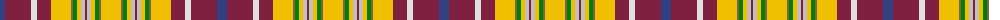

The parent of this is [Contrecoeur](/tartans/b/10/dr26/ln6/dr14/y20/lt2/g4/y4/n4/dr2/n4/y4/g4/lt2/y/20/)

This was sourced from weddslist.  It is a [15 stripes tartan](/stripes/stripes15/).

Original link http://www.weddslist.com/cgi-bin/tartans/pg.pl?source=sts

## Thread count
B/10 DR26 LN6 DR14 Y20 LT2 G4 Y4 N4 DR2 N4 Y4 G4 LT2 Y/20

## Palette
Each colour and its ΔE from the base-6 reference it is a variant of.

| Colour | Shade | Base | ΔE (OKLab) |
|---|---|---|---|
| B |  `#304080` | B  | 0.01 |
| DR |  `#802040` | R  | 0.16 |
| G |  `#008000` | G  | 0.09 |
| LN |  `#E0E0E0` | W  | 0.06 |
| LT |  `#806050` | R  | 0.17 |
| N |  `#C0C0C0` | W  | 0.16 |
| Y |  `#F0C000` | Y  | 0.01 |

ID: /variants/b/10/dr26/ln6/dr14/y20/lt2/g4/y4/n4/dr2/n4/y4/g4/lt2/y/20-b304080-dr802040-g008000-lne0e0e0-lt806050-nc0c0c0-yf0c000/
