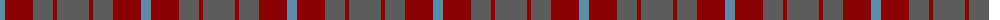

The parent of this is [Mowbray (USA) (Personal)](/tartans/b/10/dr28/n20/dr4/n/32/)

This was sourced from tartans-authority.  It is a [5 stripes tartan](/stripes/stripes5/).

Original link http://www.tartansauthority.com/tartan-ferret/display/565/

## Thread count
B/10 DR28 N20 DR4 N/32

## Palette
Each colour and its ΔE from the base-6 reference it is a variant of.

| Colour | Shade | Base | ΔE (OKLab) |
|---|---|---|---|
| B |  `#5C8CA8` | B  | 0.23 |
| DR |  `#880000` | R  | 0.14 |
| N |  `#5C5C5C` | B  | 0.14 |

# Sample pattern

ID: /variants/b/10/dr28/n20/dr4/n/32-b5c8ca8-dr880000-n5c5c5c/
