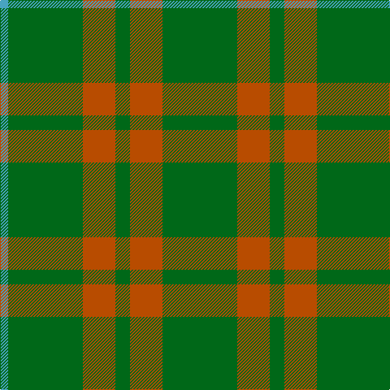

The parent of this is [O'Neill, Red](/tartans/b/10/g92/do40/g18/do40/g/92/)

This was sourced from register-of-tartans.  It is a [6 stripes tartan](/stripes/stripes6/).

Original link https://www.tartanregister.gov.uk/tartanDetails.aspx?ref=3251

## Thread count
B/10 G92 DO40 G18 DO40 G/92

## Palette
Each colour and its ΔE from the base-6 reference it is a variant of.

| Colour | Shade | Base | ΔE (OKLab) |
|---|---|---|---|
| B |  `#48A4C0` | Y  | 0.28 |
| DG |  `#003820` | G  | 0.16 |
| DO |  `#B84C00` | R  | 0.08 |
| G |  `#006818` | G  | 0.02 |

# Sample pattern

ID: /variants/b/10/g92/do40/g18/do40/g/92-b48a4c0-dg003820-dob84c00-g006818/
