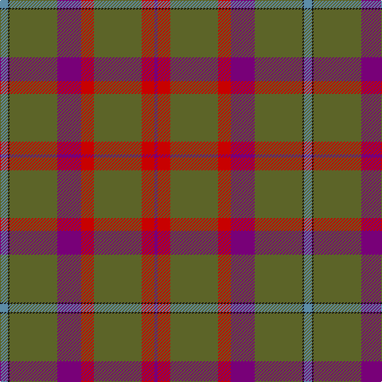

The parent of this is [Shaw of Tordarroch Hunting Clan Tartan Tartan Number: 318. Earliest known date: 1969 Also known as 'Green Shaw of Tordarroch'. Green is 'Sage Green' Proportionally reduced for display. (50%) See products available Copyright © Blair Urquhart, Comrie, 2015](/tartans/b/10/k2/g60/p30/r16/g60/r16/p/4/)

This was sourced from house-of-tartan.  It is a [8 stripes tartan](/stripes/stripes8/).

Original link http://www.house-of-tartan.scotland.net/house/TartanViewjs.asp?colr=Def&tnam=318

## Thread count
B/10 K2 G60 P30 R16 G60 R16 P/4

## Palette
Each colour and its ΔE from the base-6 reference it is a variant of.

| Colour | Shade | Base | ΔE (OKLab) |
|---|---|---|---|
| B |  `#5C8CA8` | B  | 0.23 |
| G |  `#5C6428` | G  | 0.09 |
| K |  `#101010` | K  | 0.17 |
| P |  `#780078` | B  | 0.16 |
| R |  `#C80000` | R  | 0.00 |

# Sample pattern

ID: /variants/b/10/k2/g60/p30/r16/g60/r16/p/4-b5c8ca8-g5c6428-k101010-p780078-rc80000/
