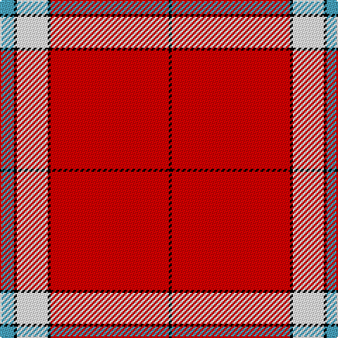

The parent of this is [Davet (2014)](/tartans/b/10/k2/w22/k2/r84/k/2/)

This was sourced from register-of-tartans.  It is a [6 stripes tartan](/stripes/stripes6/).

Original link https://www.tartanregister.gov.uk/tartanDetails.aspx?ref=10984

## Thread count
B/10 K2 W22 K2 R84 K/2

## Palette
Each colour and its ΔE from the base-6 reference it is a variant of.

| Colour | Shade | Base | ΔE (OKLab) |
|---|---|---|---|
| B |  `#48A4C0` | Y  | 0.28 |
| K |  `#000000` | K  | 0.00 |
| R |  `#DC0000` | R  | 0.04 |
| W |  `#FFFFFF` | W  | 0.03 |

# Sample pattern

ID: /variants/b/10/k2/w22/k2/r84/k/2-b48a4c0-k000000-rdc0000-wffffff/
