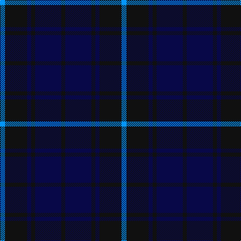

The parent of this is [Slanj, The](/tartans/b/10/k44/db8/k8/db52/k/8/)

This was sourced from register-of-tartans.  It is a [6 stripes tartan](/stripes/stripes6/).

Original link https://www.tartanregister.gov.uk/tartanDetails.aspx?ref=5450

## Thread count
B/10 K44 DB8 K8 DB52 K/8

## Palette
Each colour and its ΔE from the base-6 reference it is a variant of.

| Colour | Shade | Base | ΔE (OKLab) |
|---|---|---|---|
| B |  `#0596FA` | B  | 0.28 |
| DB |  `#080848` | B  | 0.19 |
| K |  `#101010` | K  | 0.17 |

# Sample pattern

ID: /variants/b/10/k44/db8/k8/db52/k/8-b0596fa-db080848-k101010/
