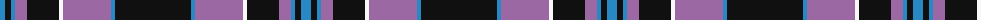

The parent of this is [Universal Scientific Indust (Corp.)](/tartans/b/10/k6/b4/lp12/k32/w4/lp48/b4/k/76/)

This was sourced from tartans-authority.  It is a [9 stripes tartan](/stripes/stripes9/).

Original link http://www.tartansauthority.com/tartan-ferret/display/2588/

## Thread count
B/10 K6 B4 LP12 K32 W4 LP48 B4 K/76

## Palette
Each colour and its ΔE from the base-6 reference it is a variant of.

| Colour | Shade | Base | ΔE (OKLab) |
|---|---|---|---|
| B |  `#2888C4` | B  | 0.21 |
| K |  `#101010` | K  | 0.17 |
| LP |  `#9C68A4` | R  | 0.21 |
| W |  `#F8F8F8` | W  | 0.01 |

ID: /variants/b/10/k6/b4/lp12/k32/w4/lp48/b4/k/76-b2888c4-k101010-lp9c68a4-wf8f8f8/
