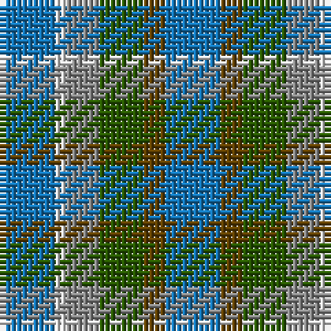

The parent of this is [Heriot Bay (District)](/tartans/b/10/ln2/n6/g8/t4/b/10/)

This was sourced from tartans-authority.  It is a [6 stripes tartan](/stripes/stripes6/).

Original link http://www.tartansauthority.com/tartan-ferret/display/10431/

## Thread count
B/10 LN2 N6 G8 T4 B/10

## Palette
Each colour and its ΔE from the base-6 reference it is a variant of.

| Colour | Shade | Base | ΔE (OKLab) |
|---|---|---|---|
| B |  `#1474B4` | B  | 0.15 |
| G |  `#285800` | G  | 0.04 |
| LN |  `#E0E0E0` | W  | 0.06 |
| N |  `#888888` | R  | 0.24 |
| T |  `#604000` | G  | 0.14 |

# Sample pattern

ID: /variants/b/10/ln2/n6/g8/t4/b/10-b1474b4-g285800-lne0e0e0-n888888-t604000/
