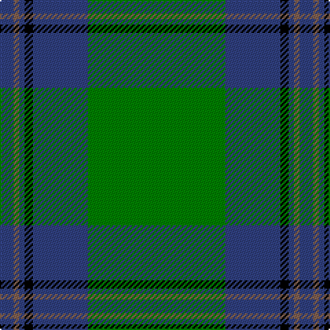

The parent of this is [St Andrews Hotel, Golf Resort, and SPA](/tartans/b/10/lt4/b4/k6/b40/g/100/)

This was sourced from weddslist.  It is a [6 stripes tartan](/stripes/stripes6/).

Original link http://www.weddslist.com/cgi-bin/tartans/pg.pl?source=sts

## Thread count
B/10 LT4 B4 K6 B40 G/100

## Palette
Each colour and its ΔE from the base-6 reference it is a variant of.

| Colour | Shade | Base | ΔE (OKLab) |
|---|---|---|---|
| B |  `#304080` | B  | 0.01 |
| G |  `#008000` | G  | 0.09 |
| K |  `#000000` | K  | 0.00 |
| LT |  `#806050` | R  | 0.17 |

# Sample pattern

ID: /variants/b/10/lt4/b4/k6/b40/g/100-b304080-g008000-k000000-lt806050/
