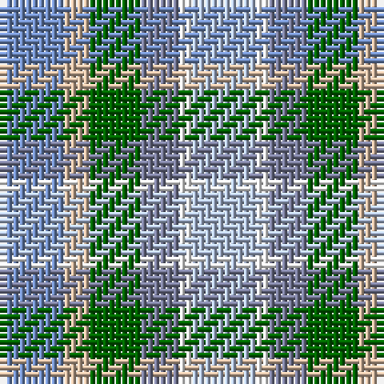

The parent of this is [Heriot Bay Local (Quadra Island, British Columbia)](/tartans/b/10/na4/g8/n6/w2/lp/10/)

This was sourced from register-of-tartans.  It is a [6 stripes tartan](/stripes/stripes6/).

Original link https://www.tartanregister.gov.uk/tartanDetails.aspx?ref=10431

## Thread count
B/10 Na4 G8 N6 W2 LP/10

## Palette
Each colour and its ΔE from the base-6 reference it is a variant of.

| Colour | Shade | Base | ΔE (OKLab) |
|---|---|---|---|
| B |  `#708CC2` | B  | 0.25 |
| G |  `#006400` | G  | 0.00 |
| LP |  `#B2C2E0` | W  | 0.16 |
| N |  `#797C9A` | B  | 0.21 |
| Na |  `#D4B8A0` | Y  | 0.13 |
| W |  `#FFFFFF` | W  | 0.03 |

# Sample pattern

ID: /variants/b/10/na4/g8/n6/w2/lp/10-b708cc2-g006400-lpb2c2e0-n797c9a-nad4b8a0-wffffff/
