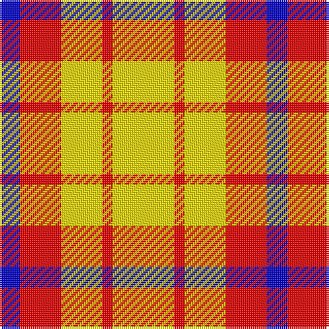

The parent of this is [Sands-Pingot Family, Alabama (Personal)](/tartans/b/10/r20/y20/r5/y/30/)

This was sourced from register-of-tartans.  It is a [5 stripes tartan](/stripes/stripes5/).

Original link https://www.tartanregister.gov.uk/tartanDetails.aspx?ref=10580

## Thread count
B/10 R20 Y20 R5 Y/30

## Palette
Each colour and its ΔE from the base-6 reference it is a variant of.

| Colour | Shade | Base | ΔE (OKLab) |
|---|---|---|---|
| B |  `#0000CD` | B  | 0.15 |
| R |  `#FF0000` | R  | 0.11 |
| Y |  `#FFE600` | Y  | 0.10 |

# Sample pattern

ID: /variants/b/10/r20/y20/r5/y/30-b0000cd-rff0000-yffe600/
