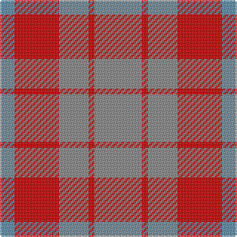

The parent of this is [Mowbray (Moubray) Family Tartan Tartan Number: 565. Earliest known date: 1983 Designed C.1984 by Peter MacDonald for a Mr Mowbray in the USA. Sometimes woven with green in place of gray, and blue in place of azure. See products available Copyright © Blair Urquhart, Comrie, 2015](/tartans/b/10/r30/n20/r4/n/32/)

This was sourced from house-of-tartan.  It is a [5 stripes tartan](/stripes/stripes5/).

Original link http://www.house-of-tartan.scotland.net/house/TartanViewjs.asp?colr=Def&tnam=565

## Thread count
B/10 R30 N20 R4 N/32

## Palette
Each colour and its ΔE from the base-6 reference it is a variant of.

| Colour | Shade | Base | ΔE (OKLab) |
|---|---|---|---|
| B |  `#5C8CA8` | B  | 0.23 |
| N |  `#888888` | R  | 0.24 |
| R |  `#C80000` | R  | 0.00 |

# Sample pattern

ID: /variants/b/10/r30/n20/r4/n/32-b5c8ca8-n888888-rc80000/
