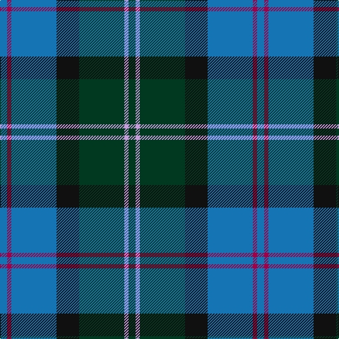

The parent of this is [MacThomas (Clan)](/tartans/b/10/r6/b64/k32/dg64/lp6/dg/10/)

This was sourced from tartans-authority.  It is a [7 stripes tartan](/stripes/stripes7/).

Original link http://www.tartansauthority.com/tartan-ferret/display/407/

## Thread count
B/10 R6 B64 K32 DG64 LP6 DG/10

## Palette
Each colour and its ΔE from the base-6 reference it is a variant of.

| Colour | Shade | Base | ΔE (OKLab) |
|---|---|---|---|
| B |  `#1474B4` | B  | 0.15 |
| DG |  `#003820` | G  | 0.16 |
| K |  `#101010` | K  | 0.17 |
| LP |  `#C49CD8` | W  | 0.24 |
| R |  `#A00048` | R  | 0.11 |

# Sample pattern

ID: /variants/b/10/r6/b64/k32/dg64/lp6/dg/10-b1474b4-dg003820-k101010-lpc49cd8-ra00048/
