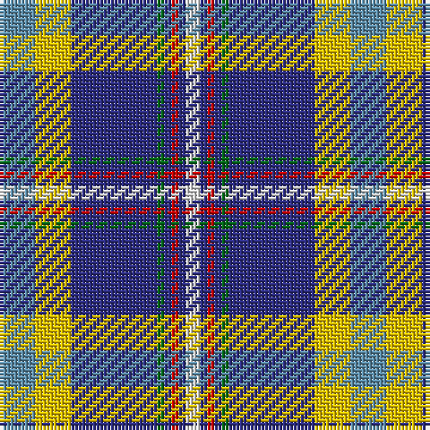

The parent of this is [Yorkshire C.C.C. Corporate Tartan Tartan Number: 670. Earliest known date: 1983 Nothing See products available Copyright © Blair Urquhart, Comrie, 2015](/tartans/b/10/y10/db24/g2/db2/r2/db2/ln/4/)

This was sourced from house-of-tartan.  It is a [8 stripes tartan](/stripes/stripes8/).

Original link http://www.house-of-tartan.scotland.net/house/TartanViewjs.asp?colr=Def&tnam=670

## Thread count
B/10 Y10 DB24 G2 DB2 R2 DB2 LN/4

## Palette
Each colour and its ΔE from the base-6 reference it is a variant of.

| Colour | Shade | Base | ΔE (OKLab) |
|---|---|---|---|
| B |  `#5C8CA8` | B  | 0.23 |
| DB |  `#2C2C80` | B  | 0.05 |
| G |  `#006818` | G  | 0.02 |
| LN |  `#E0E0E0` | W  | 0.06 |
| R |  `#C80000` | R  | 0.00 |
| Y |  `#E8C000` | Y  | 0.00 |

# Sample pattern

ID: /variants/b/10/y10/db24/g2/db2/r2/db2/ln/4-b5c8ca8-db2c2c80-g006818-lne0e0e0-rc80000-ye8c000/
