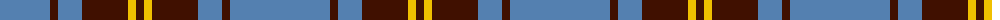

The parent of this is [Sligo](/tartans/b/100/dr8/b24/dr46/y8/dr/8/)

This was sourced from weddslist.  It is a [6 stripes tartan](/stripes/stripes6/).

Original link http://www.weddslist.com/cgi-bin/tartans/pg.pl?source=sts

## Thread count
B/100 DR8 B24 DR46 Y8 DR/8

## Palette
Each colour and its ΔE from the base-6 reference it is a variant of.

| Colour | Shade | Base | ΔE (OKLab) |
|---|---|---|---|
| B |  `#5480B0` | B  | 0.20 |
| DR |  `#401000` | B  | 0.23 |
| Y |  `#F0C000` | Y  | 0.01 |

# Sample pattern

ID: /variants/b/100/dr8/b24/dr46/y8/dr/8-b5480b0-dr401000-yf0c000/
