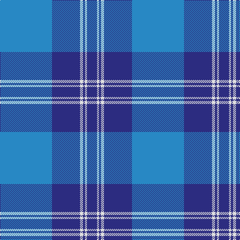

The parent of this is [St Andrews Earl of Royal family Tartan Tartan Number: 85. Earliest known date: c.1930 Count taken from a 'MacKinlay Strip'. Prince George is reputed to have worn this tartan at a Scottish Society dinner in 1919 and kept everyone guessing the name of the tartan. However, MacKinlay's record shows the design dating to 1930. No further details can be found. The sett has much in common with the Clan Donald. Royal titles of territorial origin provide a precedent for considering tartans of the name, District tartans. See products available Copyright © Blair Urquhart, Comrie, 2015](/tartans/b/104/db56/ln6/db4/ln4/db/20/)

This was sourced from house-of-tartan.  It is a [6 stripes tartan](/stripes/stripes6/).

Original link http://www.house-of-tartan.scotland.net/house/TartanViewjs.asp?colr=Def&tnam=85

## Thread count
B/104 DB56 LN6 DB4 LN4 DB/20

## Palette
Each colour and its ΔE from the base-6 reference it is a variant of.

| Colour | Shade | Base | ΔE (OKLab) |
|---|---|---|---|
| B |  `#2888C4` | B  | 0.21 |
| DB |  `#2C2C80` | B  | 0.05 |
| LN |  `#E0E0E0` | W  | 0.06 |

# Sample pattern

ID: /variants/b/104/db56/ln6/db4/ln4/db/20-b2888c4-db2c2c80-lne0e0e0/
