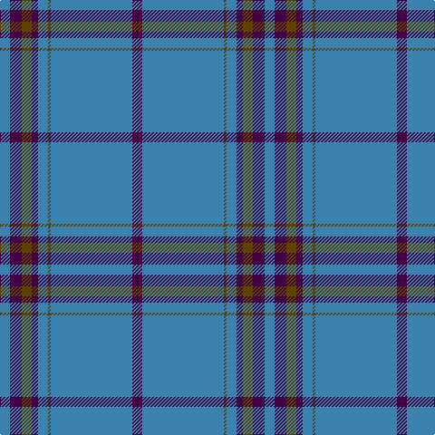

The parent of this is [Royal Conservatoire of Scotland](/tartans/b/11/dp13/t11/dp7/b11/t3/b90/dp/11/)

This was sourced from register-of-tartans.  It is a [8 stripes tartan](/stripes/stripes8/).

Original link https://www.tartanregister.gov.uk/tartanDetails.aspx?ref=11650

## Thread count
B/11 DP13 T11 DP7 B11 T3 B90 DP/11

## Palette
Each colour and its ΔE from the base-6 reference it is a variant of.

| Colour | Shade | Base | ΔE (OKLab) |
|---|---|---|---|
| B |  `#3C82AF` | B  | 0.20 |
| DP |  `#440044` | B  | 0.17 |
| T |  `#604000` | G  | 0.14 |

# Sample pattern

ID: /variants/b/11/dp13/t11/dp7/b11/t3/b90/dp/11-b3c82af-dp440044-t604000/
