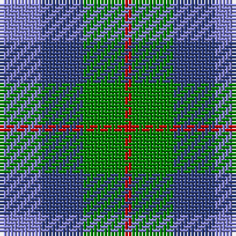

The parent of this is [Unnamed No 40](/tartans/b/12/ba12/g12/r/2/)

This was sourced from weddslist.  It is a [4 stripes tartan](/stripes/stripes4/).

Original link http://www.weddslist.com/cgi-bin/tartans/pg.pl?source=sts

## Thread count
B/12 Ba12 G12 R/2

## Palette
Each colour and its ΔE from the base-6 reference it is a variant of.

| Colour | Shade | Base | ΔE (OKLab) |
|---|---|---|---|
| B |  `#8080D0` | B  | 0.24 |
| Ba |  `#304080` | B  | 0.01 |
| G |  `#008000` | G  | 0.09 |
| R |  `#C00000` | R  | 0.02 |

# Sample pattern

ID: /variants/b/12/ba12/g12/r/2-b8080d0-ba304080-g008000-rc00000/
