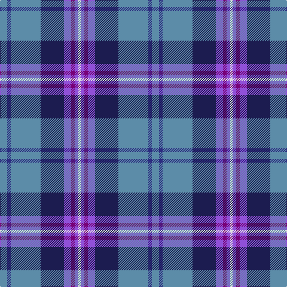

The parent of this is [Pride of the Nation (Fashion)](/tartans/b/12/db6/b50/dba39/p12/pa6/p6/ln/4/)

This was sourced from tartans-authority.  It is a [8 stripes tartan](/stripes/stripes8/).

Original link http://www.tartansauthority.com/tartan-ferret/display/8026/

## Thread count
B/12 DB6 B50 DBa39 P12 Pa6 P6 LN/4

## Palette
Each colour and its ΔE from the base-6 reference it is a variant of.

| Colour | Shade | Base | ΔE (OKLab) |
|---|---|---|---|
| B |  `#5C8CA8` | B  | 0.23 |
| DB |  `#2C2C80` | B  | 0.05 |
| DBa |  `#1C1C50` | B  | 0.14 |
| LN |  `#E0E0E0` | W  | 0.06 |
| P |  `#9050D8` | B  | 0.22 |
| Pa |  `#780078` | B  | 0.16 |

# Sample pattern

ID: /variants/b/12/db6/b50/dba39/p12/pa6/p6/ln/4-b5c8ca8-db2c2c80-dba1c1c50-lne0e0e0-p9050d8-pa780078/
