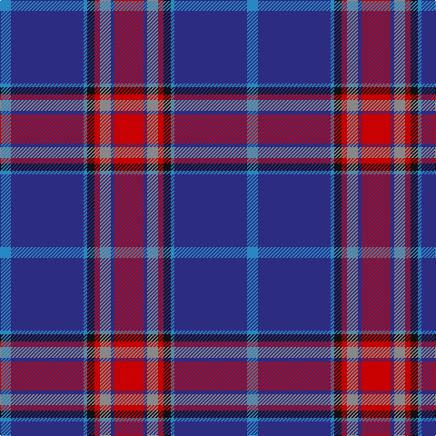

The parent of this is [St. Leonards (Corporate)](/tartans/b/12/db80/b4/k8/r6/n12/db4/r/32/)

This was sourced from tartans-authority.  It is a [8 stripes tartan](/stripes/stripes8/).

Original link http://www.tartansauthority.com/tartan-ferret/display/4075/

## Thread count
B/12 DB80 B4 K8 R6 N12 DB4 R/32

## Palette
Each colour and its ΔE from the base-6 reference it is a variant of.

| Colour | Shade | Base | ΔE (OKLab) |
|---|---|---|---|
| B |  `#2888C4` | B  | 0.21 |
| DB |  `#2C2C80` | B  | 0.05 |
| K |  `#101010` | K  | 0.17 |
| N |  `#888888` | R  | 0.24 |
| R |  `#C80000` | R  | 0.00 |

# Sample pattern

ID: /variants/b/12/db80/b4/k8/r6/n12/db4/r/32-b2888c4-db2c2c80-k101010-n888888-rc80000/
