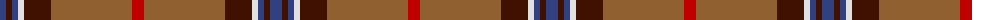

The parent of this is [Unidentified 35](/tartans/b/12/dr6/b6/ln6/dr27/lt81/r/12/)

This was sourced from weddslist.  It is a [7 stripes tartan](/stripes/stripes7/).

Original link http://www.weddslist.com/cgi-bin/tartans/pg.pl?source=sts

## Thread count
B/12 DR6 B6 LN6 DR27 LT81 R/12

## Palette
Each colour and its ΔE from the base-6 reference it is a variant of.

| Colour | Shade | Base | ΔE (OKLab) |
|---|---|---|---|
| B |  `#304080` | B  | 0.01 |
| DR |  `#401000` | B  | 0.23 |
| LN |  `#E0E0E0` | W  | 0.06 |
| LT |  `#906030` | R  | 0.15 |
| R |  `#C00000` | R  | 0.02 |

# Sample pattern

ID: /variants/b/12/dr6/b6/ln6/dr27/lt81/r/12-b304080-dr401000-lne0e0e0-lt906030-rc00000/
