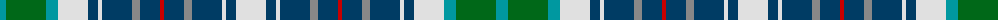

The parent of this is [Copar a'Beannichte Dress Family Tartan Tartan Number: 6484. Earliest known date: 2004 The name of the tartan is constructed in Gaelic from the Dutch van Koperen and the French Benoist to mean the Blessed Copper, a tribute to Mrs Y Ch van Koperen-Benoist. The green represents oxidised copper of the Koperens and blue the Benoist family. See products available Copyright © Blair Urquhart, Comrie, 2015](/tartans/b/12/g40/b12/ln30/db10/ln4/db30/n8/db20/r4/db20/n8/db30/ln4/db10/ln/30/)

This was sourced from house-of-tartan.  It is a [16 stripes tartan](/stripes/stripes16/).

Original link http://www.house-of-tartan.scotland.net/house/TartanViewjs.asp?colr=Def&tnam=6484

## Thread count
B/12 G40 B12 LN30 DB10 LN4 DB30 N8 DB20 R4 DB20 N8 DB30 LN4 DB10 LN/30

## Palette
Each colour and its ΔE from the base-6 reference it is a variant of.

| Colour | Shade | Base | ΔE (OKLab) |
|---|---|---|---|
| B |  `#0098A0` | G  | 0.22 |
| DB |  `#003C64` | B  | 0.07 |
| G |  `#006818` | G  | 0.02 |
| LN |  `#E0E0E0` | W  | 0.06 |
| N |  `#888888` | R  | 0.24 |
| R |  `#C80000` | R  | 0.00 |

ID: /variants/b/12/g40/b12/ln30/db10/ln4/db30/n8/db20/r4/db20/n8/db30/ln4/db10/ln/30-b0098a0-db003c64-g006818-lne0e0e0-n888888-rc80000/
