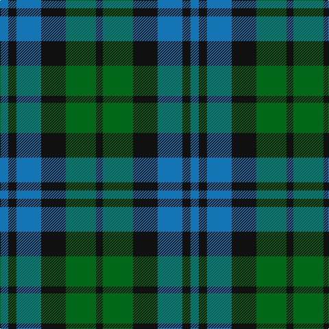

The parent of this is [Campbell, The 42nd (Military)](/tartans/b/12/k12/b36/k36/g44/k/10/)

This was sourced from tartans-authority.  It is a [6 stripes tartan](/stripes/stripes6/).

Original link http://www.tartansauthority.com/tartan-ferret/display/12/

## Thread count
B/12 K12 B36 K36 G44 K/10

## Palette
Each colour and its ΔE from the base-6 reference it is a variant of.

| Colour | Shade | Base | ΔE (OKLab) |
|---|---|---|---|
| B |  `#1474B4` | B  | 0.15 |
| G |  `#006818` | G  | 0.02 |
| K |  `#101010` | K  | 0.17 |

# Sample pattern

ID: /variants/b/12/k12/b36/k36/g44/k/10-b1474b4-g006818-k101010/
