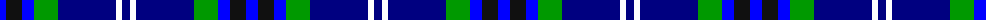
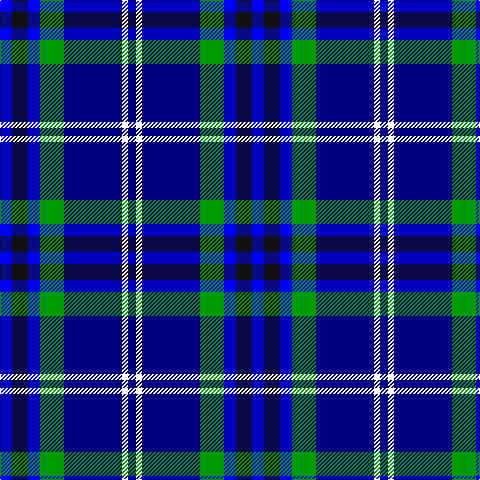

The parent of this is [Dickson (Kirkcudbrightshire)](/tartans/b/12/k16/b12/g24/db58/w6/db/8/)

This was sourced from register-of-tartans.  It is a [7 stripes tartan](/stripes/stripes7/).

Original link https://www.tartanregister.gov.uk/tartanDetails.aspx?ref=10140

## Thread count
B/12 K16 B12 G24 DB58 W6 DB/8

## Palette
Each colour and its ΔE from the base-6 reference it is a variant of.

| Colour | Shade | Base | ΔE (OKLab) |
|---|---|---|---|
| B |  `#0000FF` | B  | 0.21 |
| DB |  `#000080` | B  | 0.14 |
| G |  `#009900` | G  | 0.16 |
| K |  `#101010` | K  | 0.17 |
| W |  `#FFFFFF` | W  | 0.03 |

# Sample pattern

ID: /variants/b/12/k16/b12/g24/db58/w6/db/8-b0000ff-db000080-g009900-k101010-wffffff/
