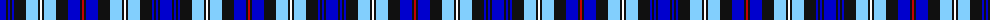

The parent of this is [MacKenzie Blue](/tartans/b/12/k2/b2/k2/b2/k12/lb12/k2/w2/k2/lb12/k12/b12/k2/r/2/)

This was sourced from register-of-tartans.  It is a [15 stripes tartan](/stripes/stripes15/).

Original link https://www.tartanregister.gov.uk/tartanDetails.aspx?ref=6028

## Thread count
B/12 K2 B2 K2 B2 K12 LB12 K2 W2 K2 LB12 K12 B12 K2 R/2

## Palette
Each colour and its ΔE from the base-6 reference it is a variant of.

| Colour | Shade | Base | ΔE (OKLab) |
|---|---|---|---|
| B |  `#0000CD` | B  | 0.15 |
| K |  `#101010` | K  | 0.17 |
| LB |  `#82CFFD` | W  | 0.18 |
| R |  `#C80000` | R  | 0.00 |
| W |  `#FFFFFF` | W  | 0.03 |

ID: /variants/b/12/k2/b2/k2/b2/k12/lb12/k2/w2/k2/lb12/k12/b12/k2/r/2-b0000cd-k101010-lb82cffd-rc80000-wffffff/
