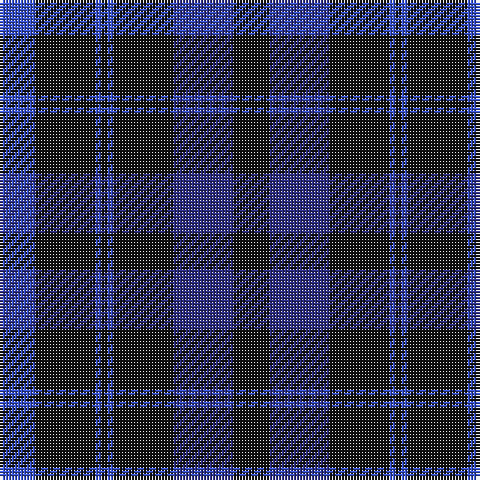

The parent of this is [Oban (Fashion)](/tartans/b/12/k20/b2/k2/b2/k20/db20/k/12/)

This was sourced from tartans-authority.  It is a [8 stripes tartan](/stripes/stripes8/).

Original link http://www.tartansauthority.com/tartan-ferret/display/5529/

## Thread count
B/12 K20 B2 K2 B2 K20 DB20 K/12

## Palette
Each colour and its ΔE from the base-6 reference it is a variant of.

| Colour | Shade | Base | ΔE (OKLab) |
|---|---|---|---|
| B |  `#3850C8` | B  | 0.12 |
| DB |  `#2C2C80` | B  | 0.05 |
| K |  `#101010` | K  | 0.17 |

# Sample pattern

ID: /variants/b/12/k20/b2/k2/b2/k20/db20/k/12-b3850c8-db2c2c80-k101010/
