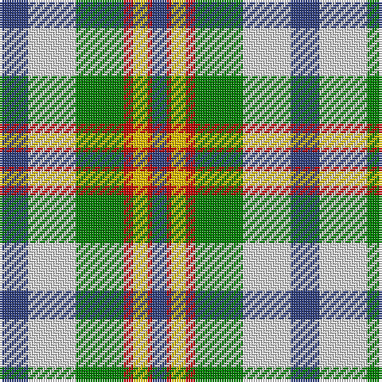

The parent of this is [Ainslie, Lake](/tartans/b/12/ln20/g20/r4/y6/r2/b/6/)

This was sourced from weddslist.  It is a [7 stripes tartan](/stripes/stripes7/).

Original link http://www.weddslist.com/cgi-bin/tartans/pg.pl?source=sts

## Thread count
B/12 LN20 G20 R4 Y6 R2 B/6

## Palette
Each colour and its ΔE from the base-6 reference it is a variant of.

| Colour | Shade | Base | ΔE (OKLab) |
|---|---|---|---|
| B |  `#304080` | B  | 0.01 |
| G |  `#008000` | G  | 0.09 |
| LN |  `#E0E0E0` | W  | 0.06 |
| R |  `#C00000` | R  | 0.02 |
| Y |  `#F0C000` | Y  | 0.01 |

# Sample pattern

ID: /variants/b/12/ln20/g20/r4/y6/r2/b/6-b304080-g008000-lne0e0e0-rc00000-yf0c000/
