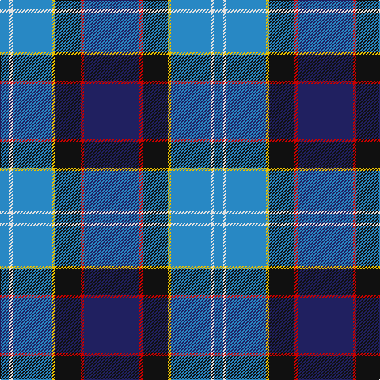

The parent of this is [US Forces (Thurso) Regimental Tartan Tartan Number: 549. Earliest known date: 1986 Originally listed as MacNeil, this sett was identified by Ken Dalgliesh, weaver in Selkirk, in 1999. See products available Copyright © Blair Urquhart, Comrie, 2015](/tartans/b/12/ln4/b50/y4/k32/r4/db/70/)

This was sourced from house-of-tartan.  It is a [7 stripes tartan](/stripes/stripes7/).

Original link http://www.house-of-tartan.scotland.net/house/TartanViewjs.asp?colr=Def&tnam=549

## Thread count
B/12 LN4 B50 Y4 K32 R4 DB/70

## Palette
Each colour and its ΔE from the base-6 reference it is a variant of.

| Colour | Shade | Base | ΔE (OKLab) |
|---|---|---|---|
| B |  `#2888C4` | B  | 0.21 |
| DB |  `#202060` | B  | 0.11 |
| K |  `#101010` | K  | 0.17 |
| LN |  `#E0E0E0` | W  | 0.06 |
| R |  `#C80000` | R  | 0.00 |
| Y |  `#E8C000` | Y  | 0.00 |

# Sample pattern

ID: /variants/b/12/ln4/b50/y4/k32/r4/db/70-b2888c4-db202060-k101010-lne0e0e0-rc80000-ye8c000/
