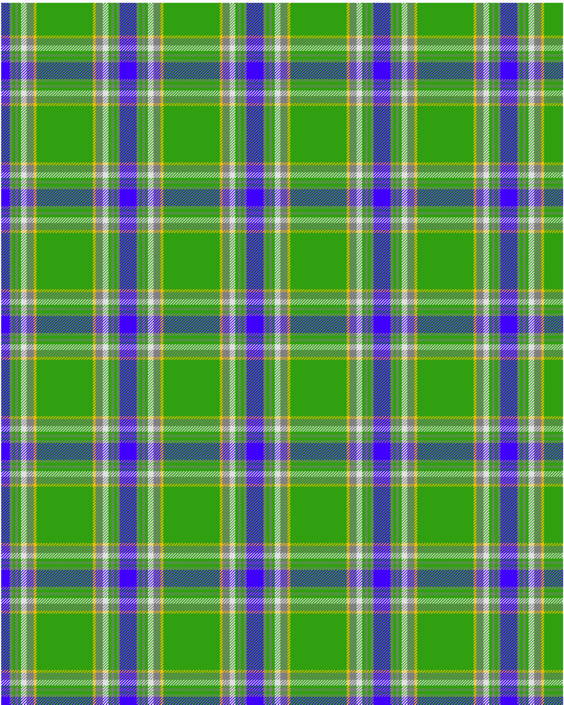

Boucherville (Tartan de..)

This was sourced from <no value>.  It is a 9 stripes tartan.

Original link http://www.weddslist.com/cgi-bin/tartans/pg.pl?source=sts

## Thread count
B/12 N4 G4 N4 G4 LN8 N10 Y4 G/40

## Palette
B#4000FF G#30A010 LN#E0E0E0 N#808080 Y#F0C000

# Sample pattern

ID: /variants/b/12/n4/g4/n4/g4/ln8/n10/y4/g/40-b4000ff-g30a010-lne0e0e0-n808080-yf0c000