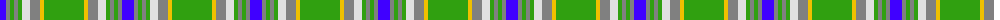

The parent of this is [Boucherville (Tartan de..)](/tartans/b/12/n4/g4/n4/g4/ln8/n10/y4/g/40/)

This was sourced from weddslist.  It is a [9 stripes tartan](/stripes/stripes9/).

Original link http://www.weddslist.com/cgi-bin/tartans/pg.pl?source=sts

## Thread count
B/12 N4 G4 N4 G4 LN8 N10 Y4 G/40

## Palette
Each colour and its ΔE from the base-6 reference it is a variant of.

| Colour | Shade | Base | ΔE (OKLab) |
|---|---|---|---|
| B |  `#4000FF` | B  | 0.20 |
| G |  `#30A010` | G  | 0.19 |
| LN |  `#E0E0E0` | W  | 0.06 |
| N |  `#808080` | G  | 0.22 |
| Y |  `#F0C000` | Y  | 0.01 |

ID: /variants/b/12/n4/g4/n4/g4/ln8/n10/y4/g/40-b4000ff-g30a010-lne0e0e0-n808080-yf0c000/
