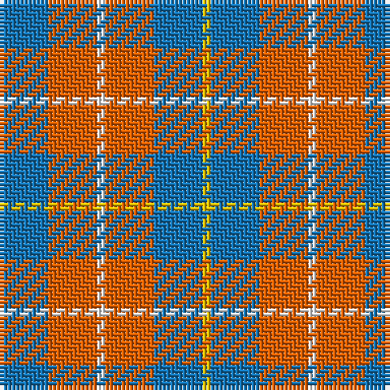

The parent of this is [Unidentified Lindley](/tartans/b/12/o12/w2/o12/b12/y/2/)

This was sourced from register-of-tartans.  It is a [6 stripes tartan](/stripes/stripes6/).

Original link https://www.tartanregister.gov.uk/tartanDetails.aspx?ref=4303

## Thread count
B/12 O12 W2 O12 B12 Y/2

## Palette
Each colour and its ΔE from the base-6 reference it is a variant of.

| Colour | Shade | Base | ΔE (OKLab) |
|---|---|---|---|
| B |  `#1474B4` | B  | 0.15 |
| O |  `#E86000` | R  | 0.14 |
| R |  `#C80000` | R  | 0.00 |
| W |  `#FCFCFC` | W  | 0.03 |
| Y |  `#E8C000` | Y  | 0.00 |

# Sample pattern

ID: /variants/b/12/o12/w2/o12/b12/y/2-b1474b4-oe86000-rc80000-wfcfcfc-ye8c000/
