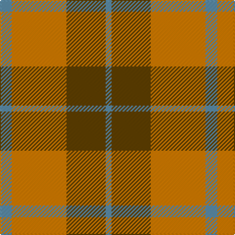

The parent of this is [Prince of Orange Tartan Tartan Number: 389. Earliest known date: pre 2003 Sales help Princess Diana Memorial Trust See products available Copyright © Blair Urquhart, Comrie, 2015](/tartans/b/12/o56/t40/b/6/)

This was sourced from house-of-tartan.  It is a [4 stripes tartan](/stripes/stripes4/).

Original link http://www.house-of-tartan.scotland.net/house/TartanViewjs.asp?colr=Def&tnam=389

## Thread count
B/12 O56 T40 B/6

## Palette
Each colour and its ΔE from the base-6 reference it is a variant of.

| Colour | Shade | Base | ΔE (OKLab) |
|---|---|---|---|
| B |  `#5C8CA8` | B  | 0.23 |
| O |  `#D87C00` | Y  | 0.17 |
| T |  `#604000` | G  | 0.14 |

# Sample pattern

ID: /variants/b/12/o56/t40/b/6-b5c8ca8-od87c00-t604000/
