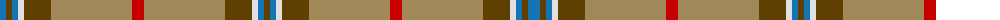

The parent of this is [Unidentified #25](/tartans/b/12/t6/b6/ln6/t27/lt81/r12/lt81/t27/ln6/b6/t/6/)

This was sourced from register-of-tartans.  It is a [12 stripes tartan](/stripes/stripes12/).

Original link https://www.tartanregister.gov.uk/tartanDetails.aspx?ref=4226

## Thread count
B/12 T6 B6 LN6 T27 LT81 R12 LT81 T27 LN6 B6 T/6

## Palette
Each colour and its ΔE from the base-6 reference it is a variant of.

| Colour | Shade | Base | ΔE (OKLab) |
|---|---|---|---|
| B |  `#1474B4` | B  | 0.15 |
| DB |  `#2C2C80` | B  | 0.05 |
| LN |  `#E0E0E0` | W  | 0.06 |
| LT |  `#A08858` | Y  | 0.21 |
| R |  `#C80000` | R  | 0.00 |
| T |  `#604000` | G  | 0.14 |

ID: /variants/b/12/t6/b6/ln6/t27/lt81/r12/lt81/t27/ln6/b6/t/6-b1474b4-db2c2c80-lne0e0e0-lta08858-rc80000-t604000/
