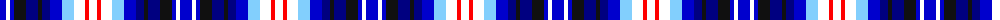

The parent of this is [Anglicare](/tartans/b/12/w4/b4/k12/db12/k4/db8/b12/lb12/w11/r4/w/8/)

This was sourced from register-of-tartans.  It is a [12 stripes tartan](/stripes/stripes12/).

Original link https://www.tartanregister.gov.uk/tartanDetails.aspx?ref=10485

## Thread count
B/12 W4 B4 K12 DB12 K4 DB8 B12 LB12 W11 R4 W/8

## Palette
Each colour and its ΔE from the base-6 reference it is a variant of.

| Colour | Shade | Base | ΔE (OKLab) |
|---|---|---|---|
| B |  `#0000CD` | B  | 0.15 |
| DB |  `#000080` | B  | 0.14 |
| K |  `#101010` | K  | 0.17 |
| LB |  `#82CFFD` | W  | 0.18 |
| R |  `#FF0000` | R  | 0.11 |
| W |  `#FFFFFF` | W  | 0.03 |

ID: /variants/b/12/w4/b4/k12/db12/k4/db8/b12/lb12/w11/r4/w/8-b0000cd-db000080-k101010-lb82cffd-rff0000-wffffff/
