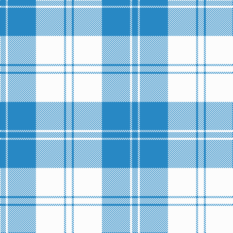

The parent of this is [Erskine, Lt Blue (Dance)](/tartans/b/12/w4/b58/w58/b4/w/12/)

This was sourced from tartans-authority.  It is a [6 stripes tartan](/stripes/stripes6/).

Original link http://www.tartansauthority.com/tartan-ferret/display/4820/

## Thread count
B/12 W4 B58 W58 B4 W/12

## Palette
Each colour and its ΔE from the base-6 reference it is a variant of.

| Colour | Shade | Base | ΔE (OKLab) |
|---|---|---|---|
| B |  `#2888C4` | B  | 0.21 |
| W |  `#FCFCFC` | W  | 0.03 |

# Sample pattern

ID: /variants/b/12/w4/b58/w58/b4/w/12-b2888c4-wfcfcfc/
