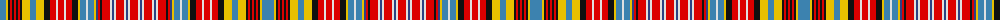

The parent of this is [Ogilvie (Paton) #2](/tartans/b/12/y2/k2/r2/k2/r2/k2/r2/k2/y8/b6/y8/k6/r6/ln2/r6/ln2/r6/k6/y2/b6/ln2/b6/y2/ba2/r2/k2/r8/ln2/ba2/ln2/r8/ln2/ba2/ln2/r/8/)

This was sourced from register-of-tartans.  It is a [36 stripes tartan](/stripes/stripes36/).

Original link https://www.tartanregister.gov.uk/tartanDetails.aspx?ref=3230

## Thread count
B/12 Y2 K2 R2 K2 R2 K2 R2 K2 Y8 B6 Y8 K6 R6 LN2 R6 LN2 R6 K6 Y2 B6 LN2 B6 Y2 Ba2 R2 K2 R8 LN2 Ba2 LN2 R8 LN2 Ba2 LN2 R/8

## Palette
Each colour and its ΔE from the base-6 reference it is a variant of.

| Colour | Shade | Base | ΔE (OKLab) |
|---|---|---|---|
| B |  `#3C82AF` | B  | 0.20 |
| Ba |  `#2C4084` | B  | 0.00 |
| K |  `#101010` | K  | 0.17 |
| LN |  `#E0E0E0` | W  | 0.06 |
| R |  `#DC0000` | R  | 0.04 |
| Y |  `#E8C000` | Y  | 0.00 |

ID: /variants/b/12/y2/k2/r2/k2/r2/k2/r2/k2/y8/b6/y8/k6/r6/ln2/r6/ln2/r6/k6/y2/b6/ln2/b6/y2/ba2/r2/k2/r8/ln2/ba2/ln2/r8/ln2/ba2/ln2/r/8-b3c82af-ba2c4084-k101010-lne0e0e0-rdc0000-ye8c000/
