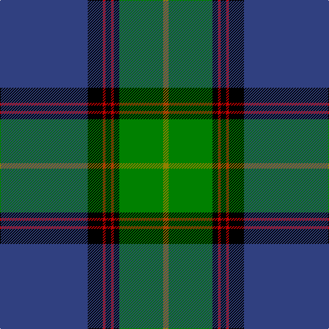

The parent of this is [Sinclair-Brown](/tartans/b/128/k22/r4/k8/r4/k8/g64/lg/8/)

This was sourced from weddslist.  It is a [8 stripes tartan](/stripes/stripes8/).

Original link http://www.weddslist.com/cgi-bin/tartans/pg.pl?source=sts

## Thread count
B/128 K22 R4 K8 R4 K8 G64 LG/8

## Palette
Each colour and its ΔE from the base-6 reference it is a variant of.

| Colour | Shade | Base | ΔE (OKLab) |
|---|---|---|---|
| B |  `#304080` | B  | 0.01 |
| G |  `#008000` | G  | 0.09 |
| K |  `#000000` | K  | 0.00 |
| LG |  `#908000` | G  | 0.19 |
| R |  `#C00000` | R  | 0.02 |

# Sample pattern

ID: /variants/b/128/k22/r4/k8/r4/k8/g64/lg/8-b304080-g008000-k000000-lg908000-rc00000/
