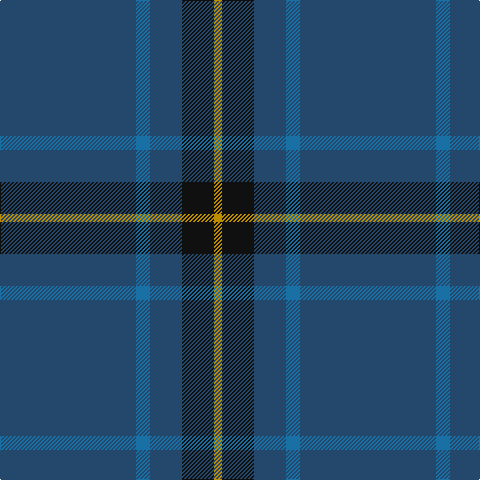

The parent of this is [Burnett's & Struth (Corporate)](/tartans/b/136/ba14/b32/k32/dy/8/)

This was sourced from tartans-authority.  It is a [5 stripes tartan](/stripes/stripes5/).

Original link http://www.tartansauthority.com/tartan-ferret/display/4085/

## Thread count
B/136 Ba14 B32 K32 DY/8

## Palette
Each colour and its ΔE from the base-6 reference it is a variant of.

| Colour | Shade | Base | ΔE (OKLab) |
|---|---|---|---|
| B |  `#24486C` | B  | 0.05 |
| Ba |  `#1870A4` | B  | 0.14 |
| DY |  `#BC8C00` | Y  | 0.16 |
| K |  `#101010` | K  | 0.17 |

# Sample pattern

ID: /variants/b/136/ba14/b32/k32/dy/8-b24486c-ba1870a4-dybc8c00-k101010/
