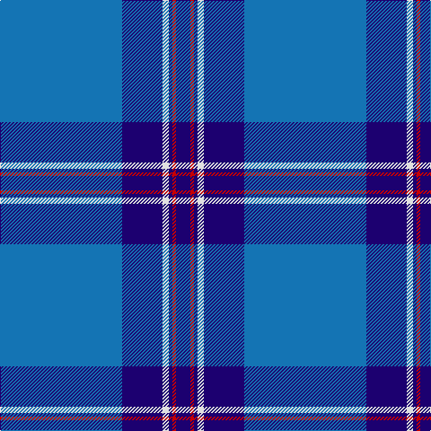

The parent of this is [S.C.O.T.S. (Corporate)](/tartans/b/136/db45/ln7/db4/r4/db/16/)

This was sourced from tartans-authority.  It is a [6 stripes tartan](/stripes/stripes6/).

Original link http://www.tartansauthority.com/tartan-ferret/display/82/

## Thread count
B/136 DB45 LN7 DB4 R4 DB/16

## Palette
Each colour and its ΔE from the base-6 reference it is a variant of.

| Colour | Shade | Base | ΔE (OKLab) |
|---|---|---|---|
| B |  `#1474B4` | B  | 0.15 |
| DB |  `#1C0070` | B  | 0.14 |
| LN |  `#E0E0E0` | W  | 0.06 |
| R |  `#C80000` | R  | 0.00 |

# Sample pattern

ID: /variants/b/136/db45/ln7/db4/r4/db/16-b1474b4-db1c0070-lne0e0e0-rc80000/
