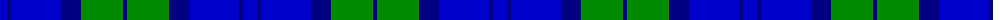

The parent of this is [Sugiyama Corporate Tartan Tartan Number: 10639. Earliest known date: 01/04/2012 The tartan design has long been used on the school bags used by middle and high school students at Sugiyama Jogakuen University. The tartan design has been used as the motif on various other items that are used at the school, such as our carrier bag, in order to promote a sense of attachment and affinity when using the items. See products available Copyright © Blair Urquhart, Comrie, 2015](/tartans/b/14/db4/b50/db20/g42/db/4/)

This was sourced from house-of-tartan.  It is a [6 stripes tartan](/stripes/stripes6/).

Original link http://www.house-of-tartan.scotland.net/house/TartanViewjs.asp?colr=Def&tnam=10639

## Thread count
B/14 DB4 B50 DB20 G42 DB/4

## Palette
Each colour and its ΔE from the base-6 reference it is a variant of.

| Colour | Shade | Base | ΔE (OKLab) |
|---|---|---|---|
| B |  `#0000CD` | B  | 0.15 |
| DB |  `#000080` | B  | 0.14 |
| G |  `#008B00` | G  | 0.12 |

# Sample pattern

ID: /variants/b/14/db4/b50/db20/g42/db/4-b0000cd-db000080-g008b00/
