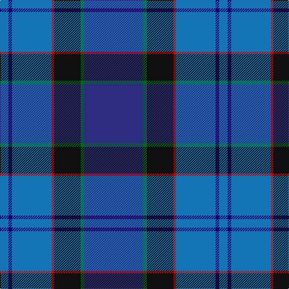

The parent of this is [U.S. 2001 Air Force (Military?)](/tartans/b/14/dba6/b66/r4/k44/g6/db/98/)

This was sourced from tartans-authority.  It is a [7 stripes tartan](/stripes/stripes7/).

Original link http://www.tartansauthority.com/tartan-ferret/display/4089/

## Thread count
B/14 DBa6 B66 R4 K44 G6 DB/98

## Palette
Each colour and its ΔE from the base-6 reference it is a variant of.

| Colour | Shade | Base | ΔE (OKLab) |
|---|---|---|---|
| B |  `#1474B4` | B  | 0.15 |
| DB |  `#2C2C80` | B  | 0.05 |
| DBa |  `#1C0070` | B  | 0.14 |
| G |  `#006818` | G  | 0.02 |
| K |  `#101010` | K  | 0.17 |
| R |  `#C80000` | R  | 0.00 |

# Sample pattern

ID: /variants/b/14/dba6/b66/r4/k44/g6/db/98-b1474b4-db2c2c80-dba1c0070-g006818-k101010-rc80000/
