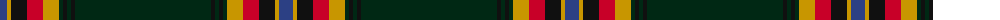

The parent of this is [Moran Family Ubique](/tartans/b/14/dy4/k16/r16/dy16/dg4/k4/dg4/k4/dg/136/)

This was sourced from register-of-tartans.  It is a [10 stripes tartan](/stripes/stripes10/).

Original link https://www.tartanregister.gov.uk/tartanDetails.aspx?ref=3006

## Thread count
B/14 DY4 K16 R16 DY16 DG4 K4 DG4 K4 DG/136

## Palette
Each colour and its ΔE from the base-6 reference it is a variant of.

| Colour | Shade | Base | ΔE (OKLab) |
|---|---|---|---|
| B |  `#2C4084` | B  | 0.00 |
| DG |  `#002814` | B  | 0.21 |
| DY |  `#C89600` | Y  | 0.12 |
| K |  `#101010` | K  | 0.17 |
| R |  `#C80028` | R  | 0.02 |

ID: /variants/b/14/dy4/k16/r16/dy16/dg4/k4/dg4/k4/dg/136-b2c4084-dg002814-dyc89600-k101010-rc80028/
