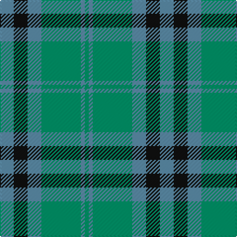

The parent of this is [Falconer of Labhdal (Personal)](/tartans/b/14/k14/b14/ba40/b4/ba/4/)

This was sourced from tartans-authority.  It is a [6 stripes tartan](/stripes/stripes6/).

Original link http://www.tartansauthority.com/tartan-ferret/display/6787/

## Thread count
B/14 K14 B14 Ba40 B4 Ba/4

## Palette
Each colour and its ΔE from the base-6 reference it is a variant of.

| Colour | Shade | Base | ΔE (OKLab) |
|---|---|---|---|
| B |  `#5C8CA8` | B  | 0.23 |
| Ba |  `#009468` | G  | 0.16 |
| K |  `#101010` | K  | 0.17 |

# Sample pattern

ID: /variants/b/14/k14/b14/ba40/b4/ba/4-b5c8ca8-ba009468-k101010/
