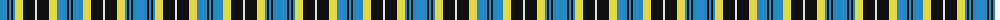

The parent of this is [Kernbrownek (Personal)](/tartans/b/14/k2/b2/k2/b2/lg8/k12/ln2/k12/lg8/b10/k2/b/2/)

This was sourced from tartans-authority.  It is a [13 stripes tartan](/stripes/stripes13/).

Original link http://www.tartansauthority.com/tartan-ferret/display/7649/

## Thread count
B/14 K2 B2 K2 B2 LG8 K12 LN2 K12 LG8 B10 K2 B/2

## Palette
Each colour and its ΔE from the base-6 reference it is a variant of.

| Colour | Shade | Base | ΔE (OKLab) |
|---|---|---|---|
| B |  `#2888C4` | B  | 0.21 |
| K |  `#101010` | K  | 0.17 |
| LG |  `#E0D844` | Y  | 0.06 |
| LN |  `#E0E0E0` | W  | 0.06 |

ID: /variants/b/14/k2/b2/k2/b2/lg8/k12/ln2/k12/lg8/b10/k2/b/2-b2888c4-k101010-lge0d844-lne0e0e0/
