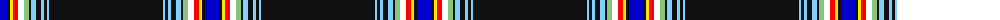

The parent of this is [Western Australia (Scottish Associations)](/tartans/b/14/k3/y3/r5/w6/lg5/k2/lb5/k5/lb3/k3/lb2/k/114/)

This was sourced from register-of-tartans.  It is a [13 stripes tartan](/stripes/stripes13/).

Original link https://www.tartanregister.gov.uk/tartanDetails.aspx?ref=10513

## Thread count
B/14 K3 Y3 R5 W6 LG5 K2 LB5 K5 LB3 K3 LB2 K/114

## Palette
Each colour and its ΔE from the base-6 reference it is a variant of.

| Colour | Shade | Base | ΔE (OKLab) |
|---|---|---|---|
| B |  `#0000CD` | B  | 0.15 |
| K |  `#101010` | K  | 0.17 |
| LB |  `#82CFFD` | W  | 0.18 |
| LG |  `#86C67C` | Y  | 0.14 |
| R |  `#FF0000` | R  | 0.11 |
| W |  `#FFFFFF` | W  | 0.03 |
| Y |  `#FFE600` | Y  | 0.10 |

ID: /variants/b/14/k3/y3/r5/w6/lg5/k2/lb5/k5/lb3/k3/lb2/k/114-b0000cd-k101010-lb82cffd-lg86c67c-rff0000-wffffff-yffe600/
