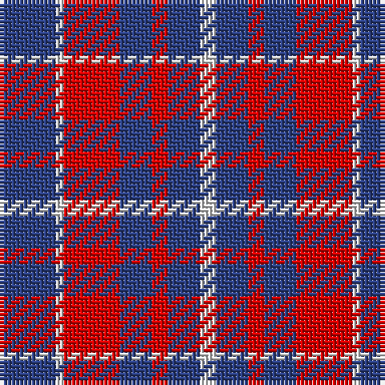

The parent of this is [Coronation](/tartans/b/14/ln2/r14/b8/r4/b8/ln/4/)

This was sourced from register-of-tartans.  It is a [7 stripes tartan](/stripes/stripes7/).

Original link https://www.tartanregister.gov.uk/tartanDetails.aspx?ref=770

## Thread count
B/14 LN2 R14 B8 R4 B8 LN/4

## Palette
Each colour and its ΔE from the base-6 reference it is a variant of.

| Colour | Shade | Base | ΔE (OKLab) |
|---|---|---|---|
| B |  `#2C4084` | B  | 0.00 |
| LN |  `#E0E0E0` | W  | 0.06 |
| R |  `#DC0000` | R  | 0.04 |

# Sample pattern

ID: /variants/b/14/ln2/r14/b8/r4/b8/ln/4-b2c4084-lne0e0e0-rdc0000/
