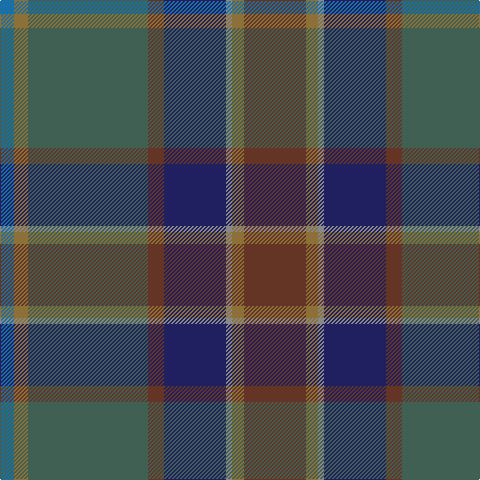

The parent of this is [Little-Dowse Wedding](/tartans/b/14/lt14/na120/t16/db62/n6/lt12/t/62/)

This was sourced from tartans-authority.  It is a [8 stripes tartan](/stripes/stripes8/).

Original link http://www.tartansauthority.com/tartan-ferret/display/11075/

## Thread count
B/14 LT14 Na120 T16 DB62 N6 LT12 T/62

## Palette
Each colour and its ΔE from the base-6 reference it is a variant of.

| Colour | Shade | Base | ΔE (OKLab) |
|---|---|---|---|
| B |  `#1870A4` | B  | 0.14 |
| DB |  `#202060` | B  | 0.11 |
| LT |  `#8C7038` | G  | 0.18 |
| N |  `#888888` | R  | 0.24 |
| Na |  `#406054` | G  | 0.11 |
| T |  `#643424` | B  | 0.17 |

# Sample pattern

ID: /variants/b/14/lt14/na120/t16/db62/n6/lt12/t/62-b1870a4-db202060-lt8c7038-n888888-na406054-t643424/
