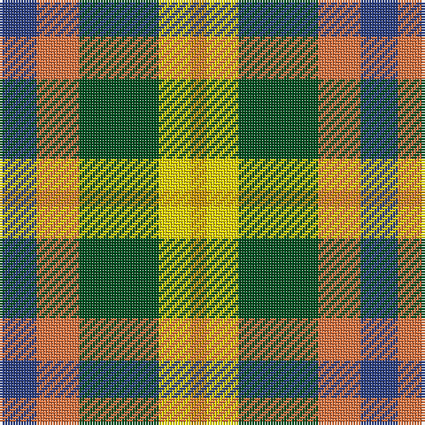

The parent of this is [Unidentified Silk Plaid](/tartans/b/14/o16/g30/y12/dy/6/)

This was sourced from register-of-tartans.  It is a [5 stripes tartan](/stripes/stripes5/).

Original link https://www.tartanregister.gov.uk/tartanDetails.aspx?ref=4383

## Thread count
B/14 O16 G30 Y12 DY/6

## Palette
Each colour and its ΔE from the base-6 reference it is a variant of.

| Colour | Shade | Base | ΔE (OKLab) |
|---|---|---|---|
| B |  `#2C4084` | B  | 0.00 |
| DY |  `#C89600` | Y  | 0.12 |
| G |  `#005020` | G  | 0.08 |
| O |  `#EC7440` | R  | 0.18 |
| Y |  `#FADC00` | Y  | 0.08 |

# Sample pattern

ID: /variants/b/14/o16/g30/y12/dy/6-b2c4084-dyc89600-g005020-oec7440-yfadc00/
